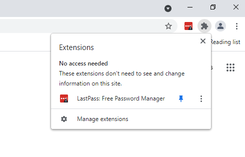
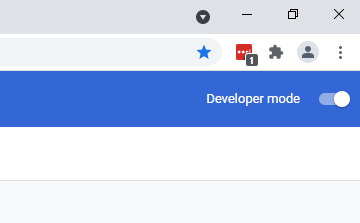
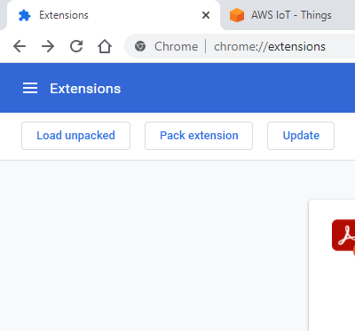
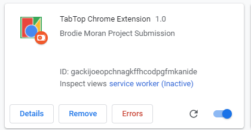

# IR-Chrome-Extension
What is contained inside this repository is the source for my COMP7716 project. It has three folders

- Backend -> contains the api for which the extension and webapp will communicate with the database with. In here we also do the majority of the modelling and grouping.
- Extension -> contains the extension to be loaded into chrome. Once loaded it will immediately start incrementing through the current tabs open and sending them to the backend api for storage in the database.
- Web-App -> contains the angular web app that should be used to connect to the backend and view your added tabs.

It is recommended that to get the easiest experience, you should use the aws deployed version of this repository. What this means is that the api, database and web-app are all located on amazon servers and ready for you to connect to right now. To do so, download the extension folder and load it into chrome(details on this are below). It will default to using the amazon services. Once the extension has finished, you can then visit the website via the url 
http://myextensionbucket.s3-website-ap-southeast-2.amazonaws.com or when the shortcut is loaded use the keybaord shortcut ```ctl+shift+1``` to open.

#### BEWARE: The security on this endpoint is near non-existent, anyone can access it. Don't put any personal or confidential content into this endpoint.(I will disable this service once I receive a grade back)

## Steps to Run Remotely (Quickest and Easiest)
### You will need
- A clone of the extension folder of this repo

### To Start
- Open Chrome
- Click on the extension icon and open the manage extensions view\
  
- Enable Developer mode in the top right\
  
- Click on Load unpacked and navigate to the extension folder from this repo\
  
- If you have successfully loaded it, then it will immediately iterate over your currently open tabs.
- If there is a desire to view the logs, you can do so by clicking the serviceworker link.\
  
- Now to view your tabs on the website. To do so, go to http://myextensionbucket.s3-website-ap-southeast-2.amazonaws.com or by pressing ```ctl+shift+1```
- For details about how each view works, read the supplied report as it goes into the benefits, weaknesses and improvements of each


## To Run Locally (advanced and takes time)

### You will need
- A clone of this repo
- MongoDB Server installed
- Nodejs12.x installed

### To Start
- Open a terminal and navigate to the backend folder.
- Run ```npm install```
- Ensure your version of Monogodb is installed and running
- Run ```npm run apiStart``` - This will launch the api service
- Open a new terminal, as the previous one needs to be left open
- Navigate to the web-app folder
- Run ```npm install```
- Execute ```npm run start``` - This will launch the angular web app
- In a browser window, navigate to localhost:4200 to open the website to confirm it is working.
- Navigate to the extension/background.js file
- Swap the apiEndpoint and websiteEndpoint variables to the local version. They should look like\
  ```const apiEndpoint = "http://localhost:8088/api/" ```\
  ```const websiteEndpoint = "http://localhost:4200/" ```
- Now load the extension using the steps provided above.
- Any actions in the chrome extension should be reflected on the web view
